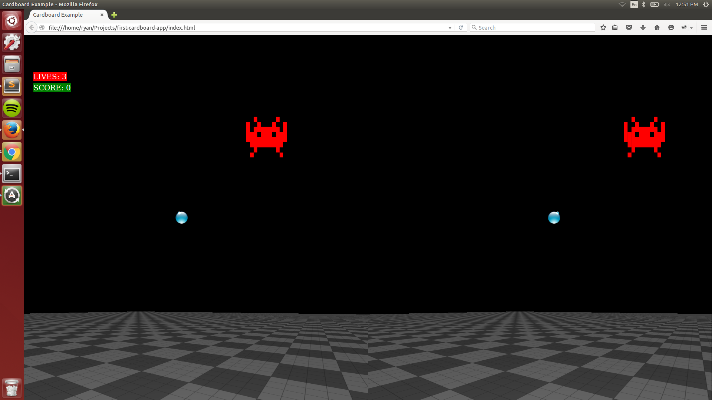
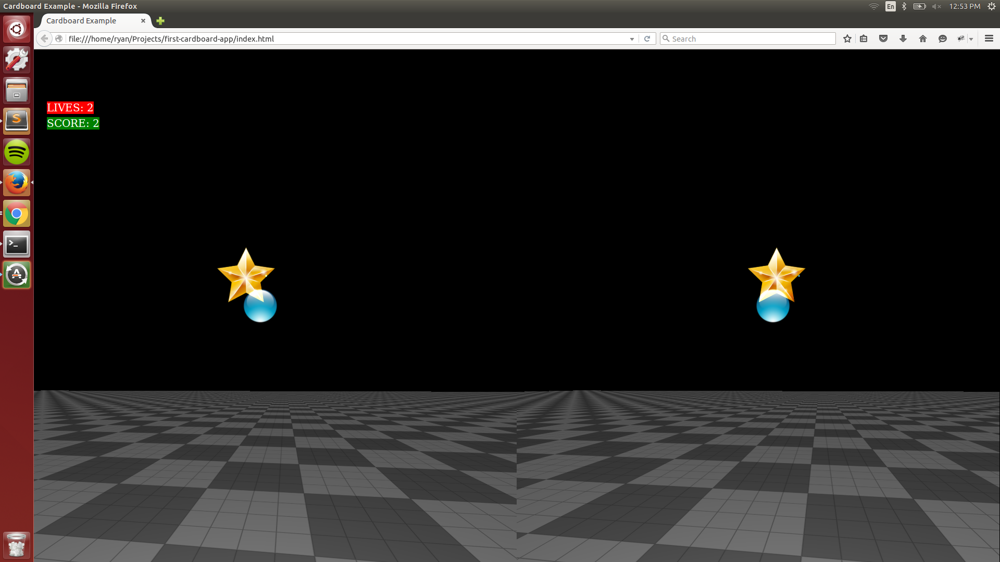

<a href="https://github.com/rjdean123/first-cardboard-app">
	Check out the code here.
</a>

OR

<a href="../cardboardgame/index.html">
	Test it out here.
</a>

#### This game is a first-person turret shooter, loosely inspired by Space Invaders. To play:

* To look around, just look around (pretty straightforward)
* To shoot, press the button on the Cardboard (or tap the screen)

#### To win:

* Shoot these guys to earn points
* Alternatively, if they get to you before you kill them, you lose a life

* Shooting a heart gives you an extra life

* Shooting a star powerup doubles the size of your bullets, making it easier to fend off aliens

## Screenshots:

